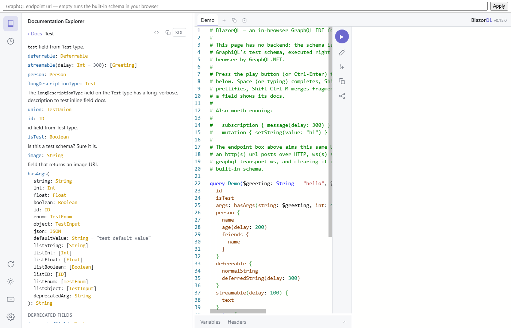
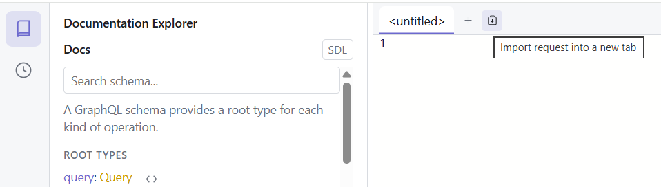
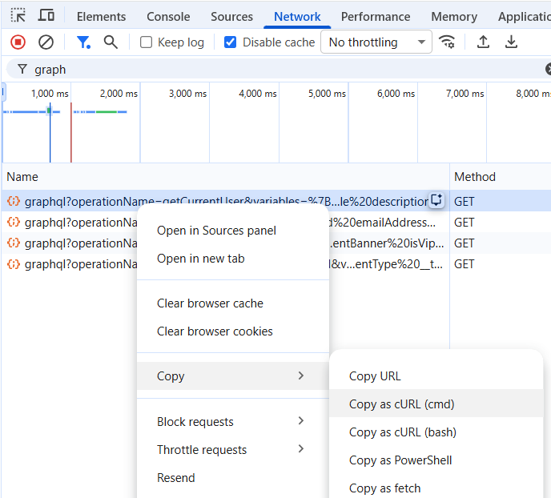
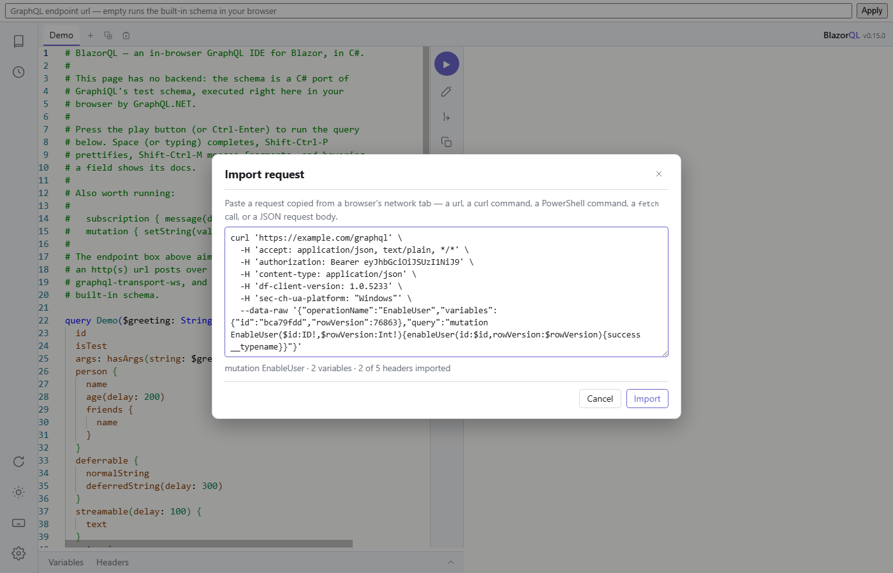
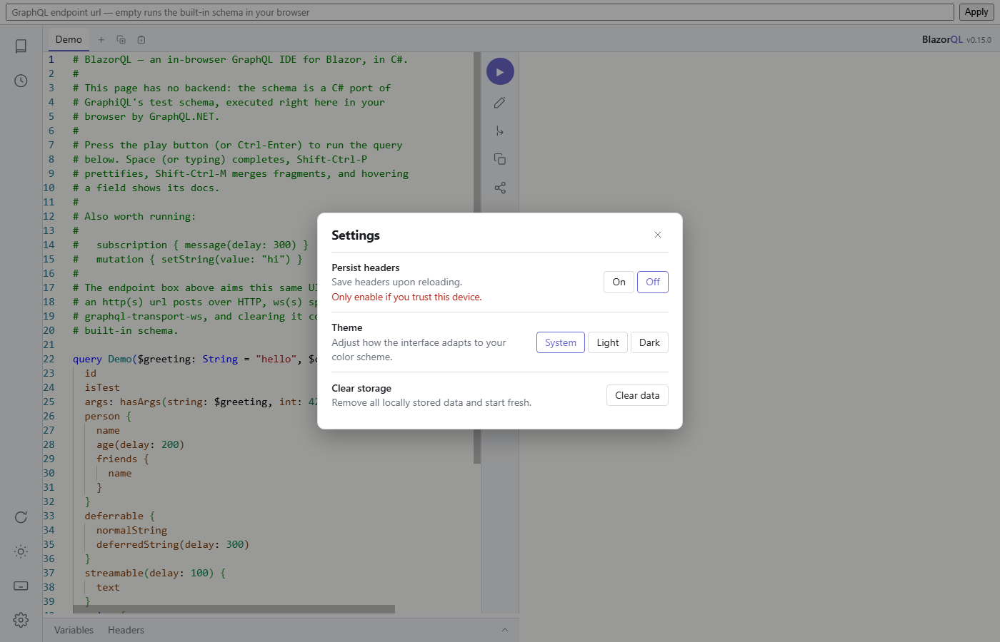

# Features

## Schema-aware editing

The operation editor is Monaco (via BlazorMonaco), with every language feature computed in C# against the introspected schema. Completion covers fields (declaration order, with docs and deprecation strikethrough), arguments, input-object fields, enum values, variables, fragment spreads, and directives. Diagnostics mark syntax errors, validation errors (the spec rules an editor can act on, checked in C# against the introspected schema), and deprecated usage; hover shows type documentation.

The variables editor validates against the active operation's variable declarations, so a wrongly typed variable is marked before anything is sent. Both the variables and headers editors accept JSONC — comments and trailing commas are tolerated.

## Documentation explorer

Navigable schema documentation: the root page lists root types and every schema type; type pages show implemented interfaces, fields with inline arguments and default values, first-paragraph description previews, and deprecated members behind a toggle; field pages show the full type, arguments, and deprecation reasons in markdown. Search (200 ms debounce) matches type names, field names, and argument names, with matches inside the current type listed before the rest. The SDL button switches the pane to the schema printed as SDL. Ctrl-click a name in the operation editor to jump to its docs.

Every object, interface, and union type carries a generate-query button — next to its name on the root page, and in the header of its type page. It opens a new tab (or fills a blank one) with a document selecting every non-deprecated member of the type: a root operation type becomes the operation of its kind, any other type is fetched through the root query fields that return it, and a type no root field returns becomes a fragment. Required arguments become variables; nested composite fields take the same default selection as fill-leafs-on-execute.

## Execution

Ctrl-Enter runs the operation containing the caret; with several operations in the document the run button opens a picker. Subscriptions stream events into the response pane until stopped (the run button becomes a stop button, and switching tabs stops too). Incremental delivery (`@defer`/`@stream`) merges patches into the accumulated response live, in both the path-based and pending/completed-id wire formats. Before a run, missing leaf selections are filled in automatically and highlighted amber for a few seconds.

The status line under the response shows the outcome and elapsed time — the HTTP status code when the transport has one.

An error that names a field gets a row of its own under the response, with the field's path and a button that takes it back out of the operation. Removing the last selection in a set takes the parent with it, and a variable nothing uses any more goes too, so what is left is still a document the server will accept. It is one row per error rather than one button for all of them: removal is not always the right answer — a field that failed for want of an argument wants the argument. Errors raised before execution reached a field have no path, and get no row; so do errors from a server that strips paths on the way out.

## Tabs, history, persistence

Tabs hold query, variables, headers, and response each; titles derive from the operation name (double-click to rename). Tabs, theme, pane sizes, and the open plugin persist across reloads — responses never do, and headers only behind the persist-headers opt-in. History records every execution (20-item cap, unlimited favorites) with labels and a search box; clicking an entry restores query, variables, and headers.

## Importing a request

The import button beside the tab strip takes a request copied out of a browser's network tab and opens it as a new tab, with the query and variables pretty-printed. Every shape devtools' copy menu produces is accepted: a GET url carrying `query`/`variables` parameters, curl in either the bash or the cmd flavour, the PowerShell `Invoke-WebRequest` form, a `fetch` call, and a bare JSON request body. The dialog reports what it found before anything is imported, so a paste it cannot read says why rather than opening an empty tab.

### Button

### Copy

### Dialog

Browser-controlled headers are dropped rather than imported — cookies, `origin`, `referer`, `user-agent`, the `sec-` client hints, and `content-length`. A page cannot set any of them, so importing them would be dead weight, and the cookie is where a captured session token lives. `authorization`, `x-` headers, and anything else application-specific survive; the status line reports how many of how many were kept. A batched body — a JSON array, as Apollo sends — becomes one tab per operation. The endpoint url is discarded: the IDE keeps talking to the fetcher the host app configured.

## Sharing

The share button copies a link carrying the query and variables in the url fragment — never headers, and a fragment never reaches a server. Opening the link restores the editors.

## Settings

