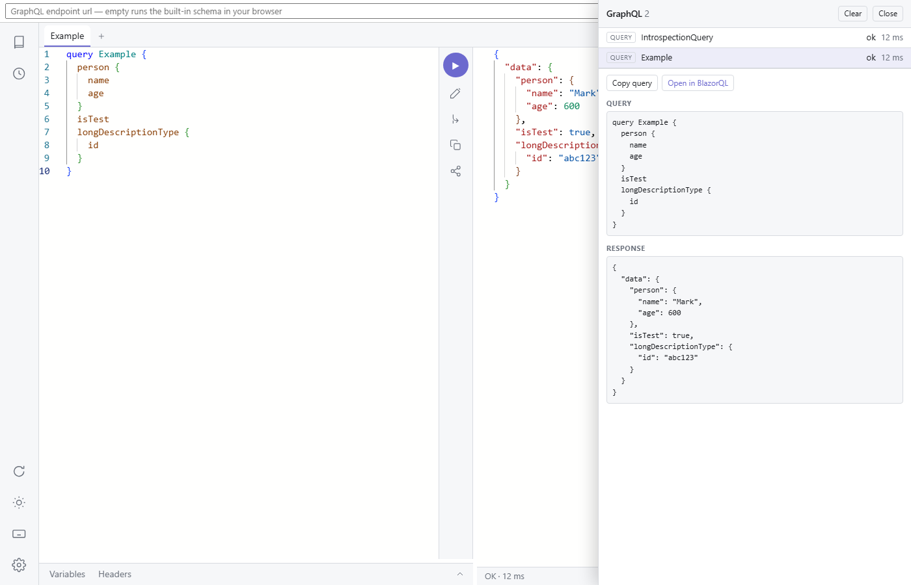

# Debug sidecar

An opt-out debug panel for pages that use BlazorQL fetchers. It opens on the right and lists every GraphQL request made through a wrapped fetcher — operation text, variables, headers, and each response document, pretty-printed. A subscription's events and incremental-delivery patches accumulate on their entry as they arrive.




## Wiring it up

Three pieces: register the services, wrap the fetcher, render the panel.

Register in `Program.cs`:

<!-- snippet: sidecarRegistrationSample -->
<a id='snippet-sidecarRegistrationSample'></a>
```cs
builder.Services.AddBlazorQLSidecar();
```
<sup><a href='/samples/BlazorQL.Sample/Program.cs#L10-L12' title='Snippet source file'>snippet source</a> | <a href='#snippet-sidecarRegistrationSample' title='Start of snippet'>anchor</a></sup>
<!-- endSnippet -->

Wrap the fetcher the app already uses — `SidecarFetcher` decorates any `IGraphQLFetcher` and changes nothing about what flows through it:

<!-- snippet: sampleFetcher -->
<a id='snippet-sampleFetcher'></a>
```razor
// The whole schema lives in the browser by default: GraphQL.NET executes it inside the WASM
// app itself, so the sample deploys to static hosting with subscriptions intact. The sidecar
// decorator records every request the IDE makes into the debug panel.
protected override void OnInitialized() =>
    fetcher = new SidecarFetcher(new LocalSchemaFetcher(), Sidecar);
```
<sup><a href='/samples/BlazorQL.Sample/App.razor#L22-L28' title='Snippet source file'>snippet source</a> | <a href='#snippet-sampleFetcher' title='Start of snippet'>anchor</a></sup>
<!-- endSnippet -->

Render the panel once, anywhere on the page:

```razor
<BlazorQLSidecar />
```

The panel loads its own stylesheet and key listener from the package's static assets, so no `index.html` edit is needed.


## Opening the panel

Two ways in:

- The keyboard shortcut, `Alt+G` by default, configurable via `ToggleShortcut`.
- A small floating button in the page corner, shown while the panel is closed. `ToggleButton` decides who sees it: `SidecarOptions.Always` (the default), `SidecarOptions.Never`, or a custom predicate over the app's services — for example, keyed off the signed-in user:

```csharp
builder.Services.AddBlazorQLSidecar(_ =>
    _.ToggleButton = async services =>
    {
        var provider = services.GetRequiredService<AuthenticationStateProvider>();
        var state = await provider.GetAuthenticationStateAsync();
        return state.User.IsInRole("developer");
    });
```

The predicate is evaluated once, when the panel first loads.


## Entry actions

Selecting an entry shows its detail: the operation text, variables, headers, and response documents. Actions on a selected entry:

- **Copy query** / **Copy variables** — to the clipboard.
- **Open in BlazorQL** — opens `IdeRoute` in a new tab with the captured query and variables carried in a `#q=` share fragment, exactly like the IDE's own share button. The fragment never reaches a server, and by construction cannot carry headers. The default route (the empty string) targets the current page, which is right when the sidecar sits beside the IDE itself; point it elsewhere when the IDE lives on another route, or set it null to hide the action.


## Options

<!-- snippet: sidecarOptions -->
<a id='snippet-sidecarOptions'></a>
```cs
/// <summary>
/// Whether requests are captured and the panel responds to its shortcut. On by default —
/// turn it off for builds where a query log over the GraphQL traffic is unwanted.
/// </summary>
public bool Enabled { get; set; } = true;

/// <summary>
/// The keyboard shortcut that opens and hides the panel, as modifier tokens plus a key
/// (for example <c>"Ctrl+Shift+D"</c>). An unrecognized value falls back to the default.
/// </summary>
public string ToggleShortcut { get; set; } = "Alt+G";

/// <summary>
/// Decides whether the small floating button is shown in the page's corner while the panel
/// is closed, as a clickable alternative to the shortcut. Shown to everyone by default —
/// set <see cref="Never"/> to rely on the shortcut alone, or an own predicate to decide from
/// the current context (the signed-in user, say). Evaluated once, when the panel first loads.
/// </summary>
public Func<IServiceProvider, ValueTask<bool>> ToggleButton { get; set; } = Always;

/// <summary>
/// Where a <see cref="BlazorQLIde"/> is routed, for the "open in BlazorQL" action on a
/// captured request — the action opens that route with the query and variables carried in a
/// <c>#q=</c> share fragment. The default empty string targets the current page, which is
/// right when the sidecar sits beside the IDE itself. Null hides the action.
/// </summary>
public string? IdeRoute { get; set; } = "";

/// <summary>Captured requests kept; the oldest is evicted beyond this.</summary>
public int MaxEntries { get; set; } = 100;

/// <summary>
/// Response documents kept per request. One request can yield many documents — incremental
/// patches, subscription events — and an unbounded subscription must not grow the log without
/// end, so documents beyond this are counted but not kept.
/// </summary>
public int MaxDocumentsPerEntry { get; set; } = 25;
```
<sup><a href='/src/BlazorQL/Sidecar/SidecarOptions.cs#L10-L48' title='Snippet source file'>snippet source</a> | <a href='#snippet-sidecarOptions' title='Start of snippet'>anchor</a></sup>
<!-- endSnippet -->

`Enabled = false` makes the component fully inert — no capture, no key listener, nothing rendered — for builds where a query log over the GraphQL traffic is unwanted.
