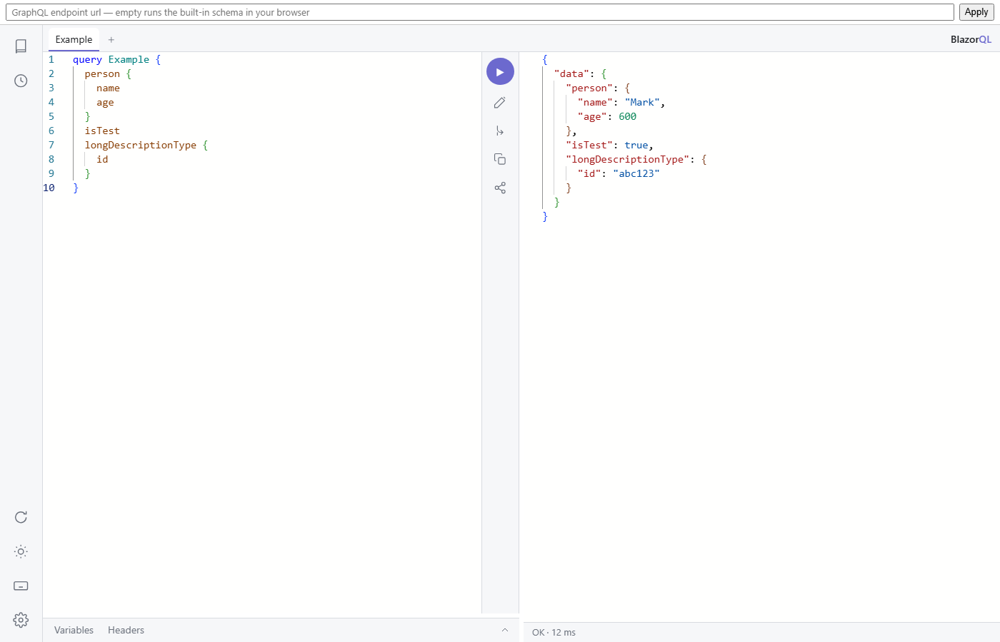

#  BlazorQL

An in-browser GraphQL IDE for Blazor — a GraphiQL alternative built as a Razor Class Library, with the shell, panes, and state written in C# and the editor intelligence powered by the same monaco-graphql language service GraphiQL itself uses.




## Features

- **Schema-aware editing**: completion (fields, arguments, input objects, enums, variables, fragments, directives), live validation with deprecation warnings, and hover docs — computed in a web worker by monaco-graphql.
- **Documentation explorer**: navigable schema docs with markdown descriptions, deprecated sections, argument defaults, bucketed search, an SDL view, and Ctrl-click jump-to-doc from the editor.
- **Tabs** with derived titles, rename, and full persistence across reloads.
- **Variables and headers editors** — JSONC tolerated, with JSON-Schema validation of variables generated from the operation's declarations.
- **Execution**: run-at-caret, an operation picker for multi-operation documents, subscriptions, and incremental delivery (`@defer`/`@stream`) merged live into the response.
- **History**: 20-item log plus unlimited favorites, labels, and a search box.
- **Toolbar**: prettify (Prettier), merge fragments, copy, share links (query + variables in the url fragment — never headers), response copy/download, and a status line.
- **Transports**: HTTP (including `multipart/mixed` incremental responses), graphql-transport-ws subscriptions, or any custom `IGraphQLFetcher` — the sample executes a GraphQL.NET schema inside the WASM app and runs on GitHub Pages with no server at all.
- **Theming**: system/light/dark, followed by the editors.

Dark mode:


## Usage

Add the `BlazorQL` package to a Blazor WebAssembly app, then render the component with a fetcher:

<!-- snippet: sampleFetcher -->
<a id='snippet-sampleFetcher'></a>
```razor
// The whole schema lives in the browser by default: GraphQL.NET executes it inside the WASM
// app itself, so the sample deploys to static hosting with subscriptions intact.
IGraphQLFetcher fetcher = new LocalSchemaFetcher();
```
<sup><a href='/samples/BlazorQL.Sample/App.razor#L16-L20' title='Snippet source file'>snippet source</a> | <a href='#snippet-sampleFetcher' title='Start of snippet'>anchor</a></sup>
<!-- endSnippet -->

```razor
<BlazorQLIde Fetcher="fetcher" />
```

A fetcher is one interface covering queries, incremental delivery, and subscriptions:

<!-- snippet: fetcherInterface -->
<a id='snippet-fetcherInterface'></a>
```cs
public interface IGraphQLFetcher
{
    IAsyncEnumerable<JsonElement> FetchAsync(
        GraphQLRequest request,
        IReadOnlyDictionary<string, string> headers,
        CancellationToken cancel);
}
```
<sup><a href='/src/BlazorQL/Fetchers/IGraphQLFetcher.cs#L8-L16' title='Snippet source file'>snippet source</a> | <a href='#snippet-fetcherInterface' title='Start of snippet'>anchor</a></sup>
<!-- endSnippet -->

Built-in fetchers: `HttpFetcher(url)` and `GraphQLWsFetcher(url)`. Anything else — like the sample's in-browser `LocalSchemaFetcher` — is one interface implementation away.


## Documentation

- [Getting started](docs/getting-started.md)
- [Features](docs/features.md)
- [Fetchers](docs/fetchers.md)
- [Theming](docs/theming.md)
- [Storage](docs/storage.md)
- [Shortcuts](docs/shortcuts.md)
- [The sample](docs/sample.md)
- [Deploying to GitHub Pages](docs/deploying-to-pages.md)


## Attribution

The editor stack vendors MIT-licensed builds of monaco-editor, monaco-graphql, graphql-language-service, graphql-js, and Prettier; the sample's schema is a C# port of GraphiQL's own test schema (GraphQL Contributors, MIT). See the headers on the vendored files.


## Icon

Placeholder icon; final icon pending.
