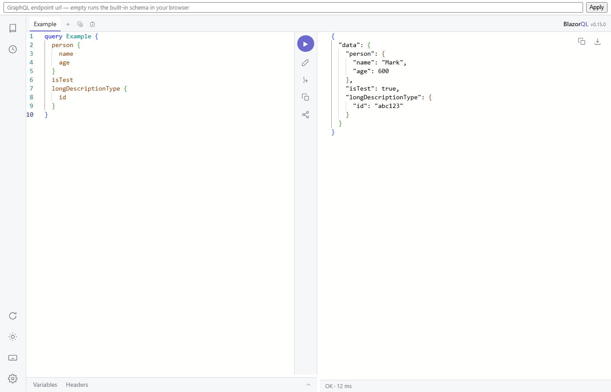
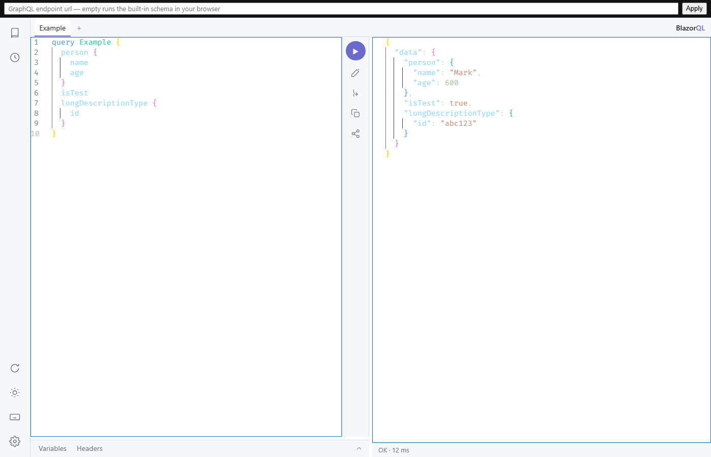

#  BlazorQL

[](https://www.nuget.org/packages/BlazorQL/)
[](https://www.nuget.org/packages/BlazorQL.Bundled/)

An in-browser GraphQL IDE built in Blazor WASM. The editors are Monaco via the BlazorMonaco package, and everything else — shell, panes, state, and every language feature (completion, validation, hover, formatting) — is C#.

**[Try it live](https://simoncropp.github.io/BlazorQL/)** — the sample on GitHub Pages, executing its whole schema in the browser: a small Blazor app consuming the schema, with the query explorer and the debug sidecar one click away.




## Features

- **Schema-aware editing**: completion (fields, arguments, input objects, enums, variables, fragments, directives), live validation with deprecation warnings, and hover docs — computed in C#, against the introspected schema.
- **Documentation explorer**: navigable schema docs with markdown descriptions, deprecated sections, argument defaults, bucketed search, an SDL view, and Ctrl-click jump-to-doc from the editor.
- **Tabs** with derived titles, rename, and full persistence across reloads.
- **Variables and headers editors** — JSONC tolerated, with variables validated against the operation's declarations.
- **Execution**: run-at-caret, an operation picker for multi-operation documents, subscriptions, and incremental delivery (`@defer`/`@stream`) merged live into the response.
- **History**: 20-item log plus unlimited favorites, labels, and a search box.
- **Toolbar**: prettify, merge fragments, copy, share links (query + variables in the url fragment — never headers), response copy/download, and a status line.
- **Transports**: HTTP (including `multipart/mixed` incremental responses), graphql-transport-ws subscriptions, or any custom `IGraphQLFetcher` — the sample executes a GraphQL.NET schema inside the WASM app and runs on GitHub Pages with no server at all.
- **Theming**: system/light/dark, followed by the editors.
- **Debug sidecar**: an opt-out panel that logs every request through a wrapped fetcher — query, variables, headers, and each response document — with a deep link that opens any captured query in the IDE.

Dark mode:




## Usage

Add the `BlazorQL` package to a Blazor WebAssembly app, then render the component with a fetcher:

```razor
<BlazorQLIde Fetcher="@(new HttpFetcher("https://example.com/graphql"))" />
```

A fetcher is one interface covering queries, incremental delivery, and subscriptions:

<!-- snippet: fetcherInterface -->
<a id='snippet-fetcherInterface'></a>
```cs
public interface IGraphQLFetcher
{
    IAsyncEnumerable<JsonElement> FetchAsync(
        GraphQLRequest request,
        IReadOnlyDictionary<string, string> headers,
        Cancel cancel);
}
```
<sup><a href='/src/BlazorQL/Fetchers/IGraphQLFetcher.cs#L8-L16' title='Snippet source file'>snippet source</a> | <a href='#snippet-fetcherInterface' title='Start of snippet'>anchor</a></sup>
<!-- endSnippet -->

Built-in fetchers: `HttpFetcher(url)` and `GraphQLWsFetcher(url)`. Anything else — like the sample's in-browser `LocalSchemaFetcher` — is one interface implementation away.

For a site that is not a Blazor app, `BlazorQL.Bundled` ships the same IDE as a single dependency-free
assembly with the whole WebAssembly application embedded — one package reference and one line:

```csharp
app.MapBlazorQL("/graphql-ide", _ => _.Endpoint = "/graphql");
```


## Documentation

- [Getting started](docs/getting-started.md)
- [BlazorQL.Bundled, for non-Blazor sites](docs/bundled.md)
- [Features](docs/features.md)
- [Fetchers](docs/fetchers.md)
- [Content Security Policy](docs/csp.md)
- [Theming](docs/theming.md)
- [Debug sidecar](docs/sidecar.md)
- [Storage](docs/storage.md)
- [Shortcuts](docs/shortcuts.md)
- [The sample](docs/sample.md)


## Attribution

The editors are [monaco-editor](https://github.com/microsoft/monaco-editor) (Microsoft, MIT) via the [BlazorMonaco](https://github.com/serdarciplak/BlazorMonaco) package (MIT). Parsing is [GraphQL-Parser](https://github.com/graphql-dotnet/parser) (MIT), with the validation rules implemented over it here; markdown rendering is [Markdig](https://github.com/xoofx/markdig) (BSD-2-Clause). The sample's schema is a C# port of GraphiQL's own test schema (GraphQL Contributors, MIT).


## Icon

Placeholder icon; final icon pending.
